
<h1 align="center">基于vue的工厂车间管理系统的设计</h1>

## 简介
基于Vue的工厂车间管理系统：角色分为管理员、用户；实现人员管理、设备信息管理、生产计划和工单管理、生产流程及工序管理功能，简化车间运营并提升信息化管理效率。    --计算机毕业设计源码；毕设源码；java毕业设计源码

## 联系方式

<h3 align="center">获取完整代码与数据库文件 + 微信：deepguan QQ: 86050149 QQ群: 783742310</h3>

<h3 align="center">可帮忙远程部署 包运行成功！提供远程部署、修改代码、设计文档指导、代码讲解等服务！</h3>

## 功能介绍（完整见运行截图）
管理员：登录管理系统，控制页面访问。管理人员信息，包括添加、编辑和删除操作。设备管理，查看、添加和编辑设备信息。管理生产订单，查看、修改、删除和创建生产任务。权限管理，确保不同角色用户访问权限配置正确。

设备操作员：访问个人中心，查看并更新个人信息。参与设备信息的录入和管理，填写设备编号、类型、数量等信息。支持生产订单的执行与查看，确认工单数量和批次信息。

生产计划员：制定生产计划和开立生产工单。输入生产批次、批次数量、工序内容等信息。查看生产批次详细信息，调整生产计划，管理工序和设备使用。

普通用户：注册和登录，查看个人中心信息。浏览系统功能模块，包括设备管理、生产计划管理等，查看生产进度和设备状态。

## 运行截图
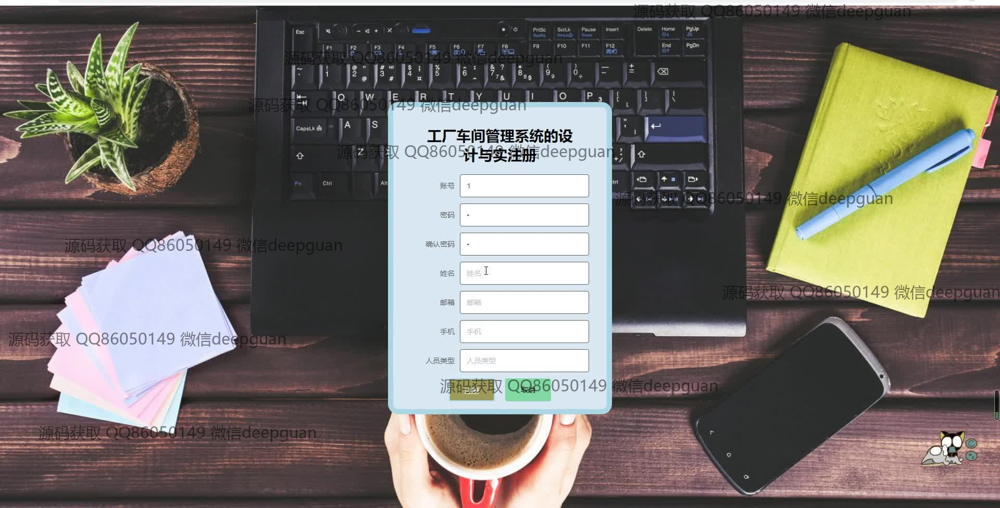

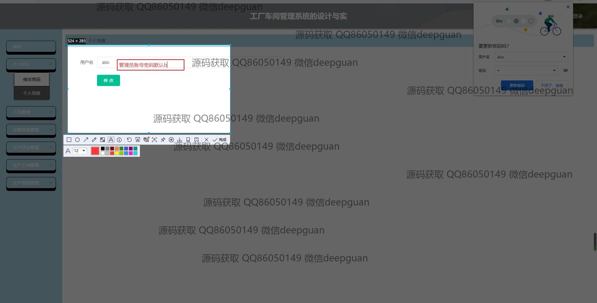
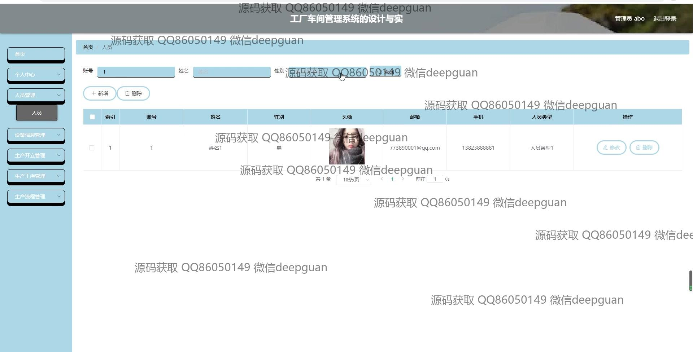
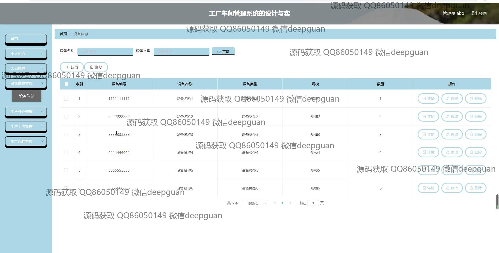
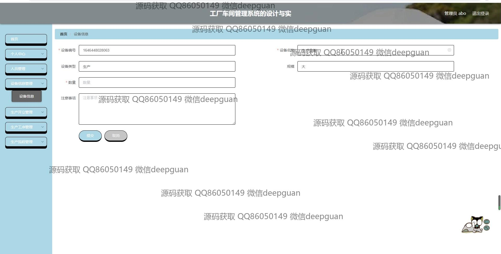
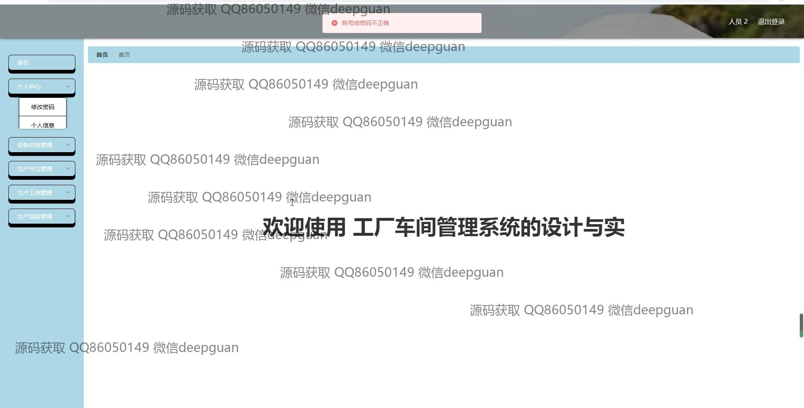
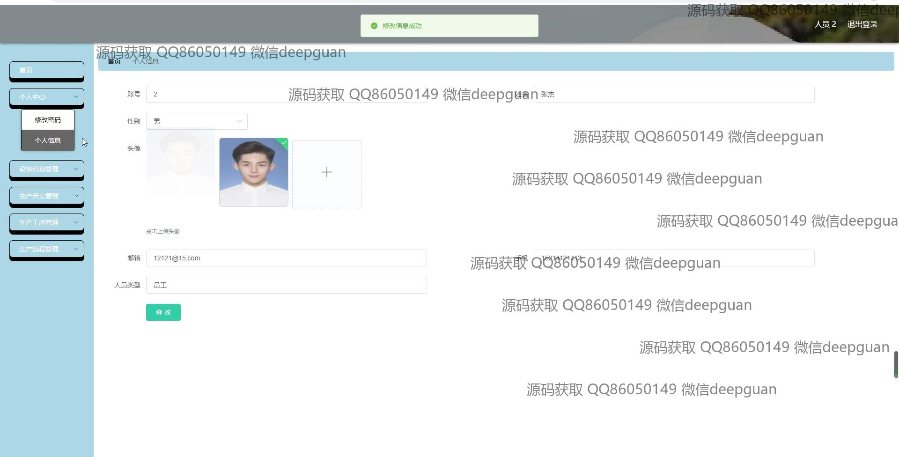
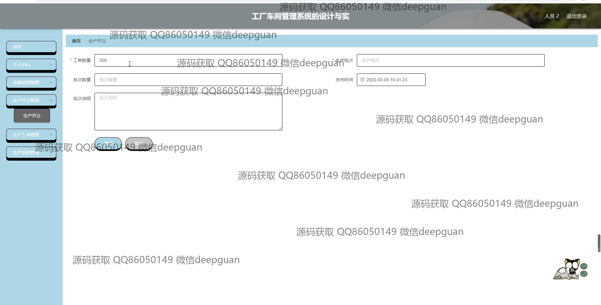
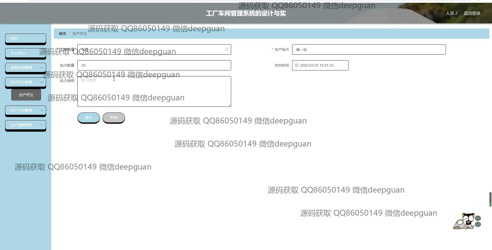
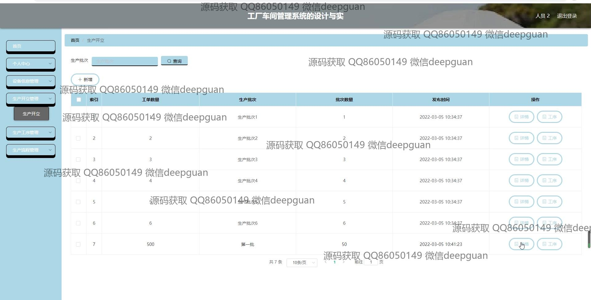
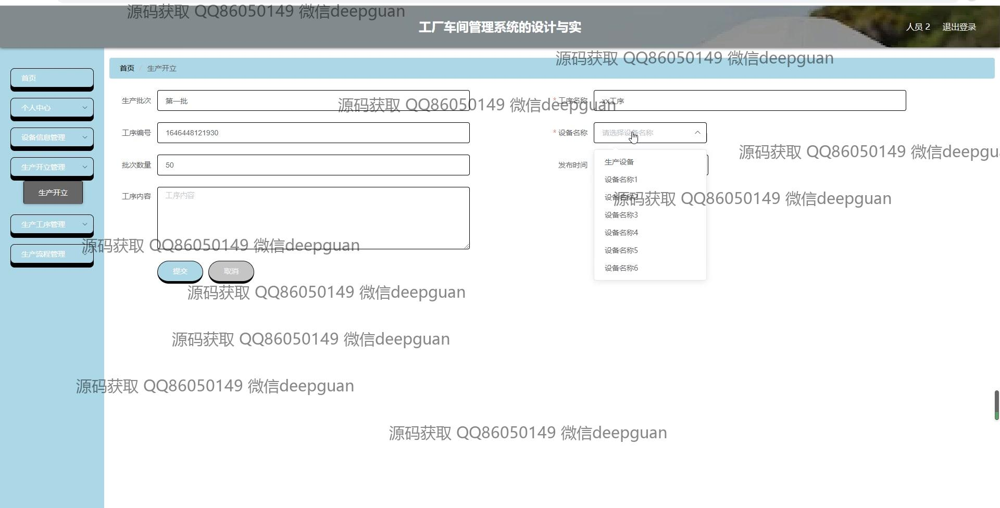
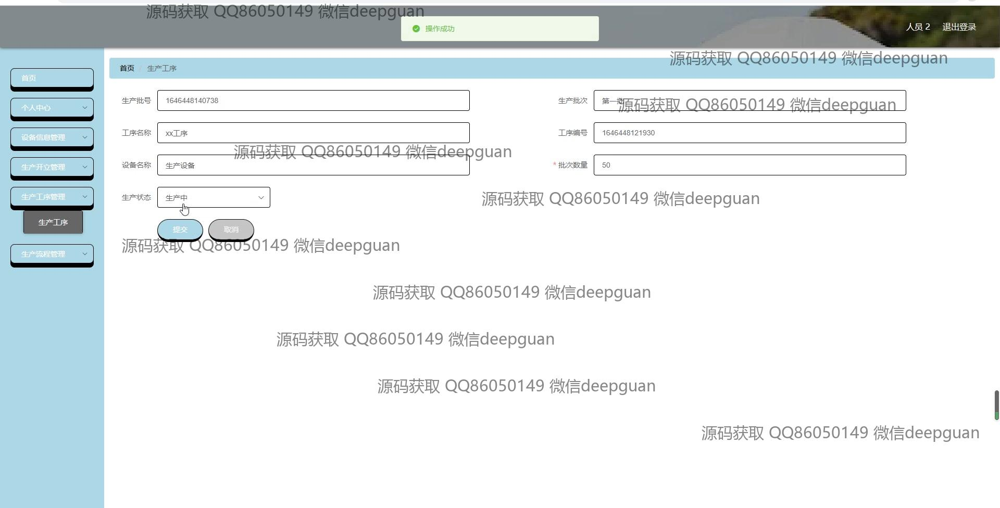
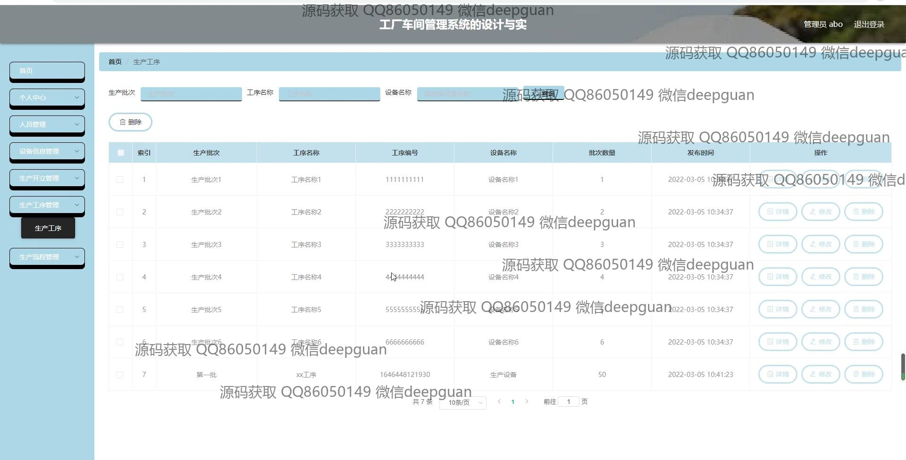
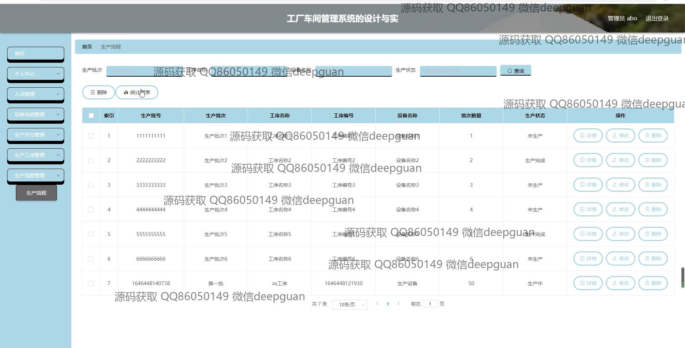
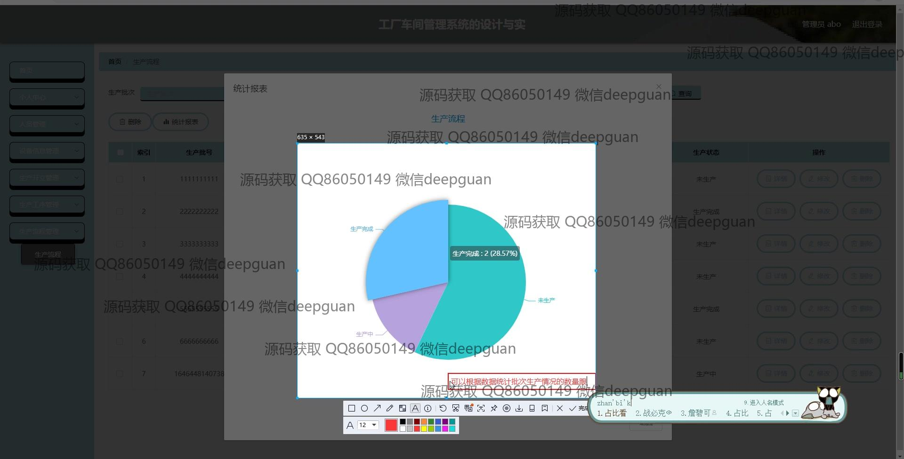

本代码来源于网络,仅供学习参考使用!

